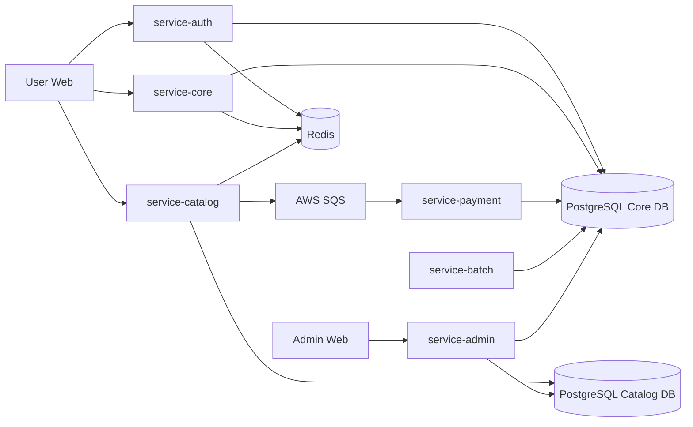
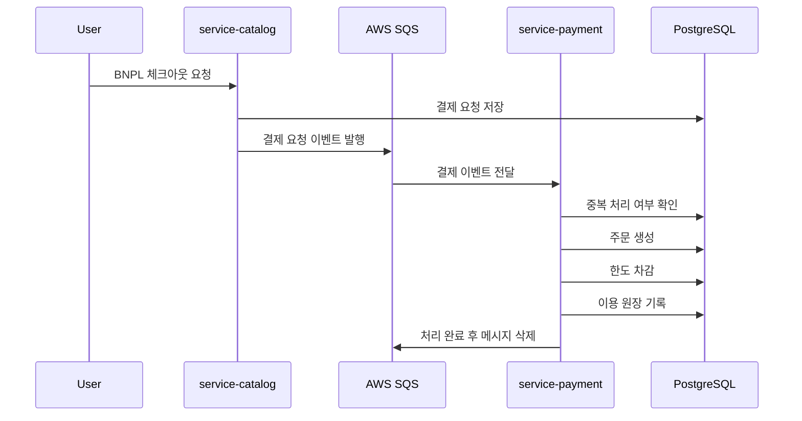
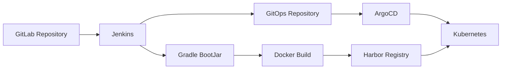

# 🌾 FISA-Agri-Pay · Back-end

> 농업 데이터 기반 **BNPL(Buy Now, Pay Later) 플랫폼**의 백엔드입니다.
> 농업인의 영농 주기와 소득 특성을 반영해 **신용 한도 산정, 외상 결제, 원장 기록, 상환/연체 배치**를 처리하는 Spring Boot 멀티모듈 MSA입니다.


---

## 목차

- [프로젝트 개요](#overview)
- [백엔드 모듈 구성](#modules)
- [핵심 업무 흐름](#workflow)
- [핵심 기능](#features)
  - [농업 데이터 기반 대안신용평가](#scoring)
  - [AWS SQS 기반 BNPL 결제 이벤트 처리](#sqs-payment)
  - [배치 처리](#batch)
  - [CQRS 기반 관리자 조회 최적화](#cqrs)
  - [인증 및 보안](#security)
  - [Observability](#observability)
- [테스트 시나리오](#test-scenarios)
- [운영 이슈 해결 사례](#troubleshooting)
- [CI/CD 및 배포 기준](#cicd)
- [기술 스택](#tech-stack)
- [디렉터리 구조](#directory)
- [관련 레포지토리](#repositories)
- [팀원 소개](#team)

---

<a id="overview"></a>

## 📌 프로젝트 개요

농업인은 파종·생육·수확 시점에 따라 소득이 불규칙하게 발생합니다.
기존 금융권의 일반적인 신용평가 방식은 이러한 **계절성 소득 구조**와 **영농 데이터**를 충분히 반영하기 어렵습니다.

FISA-Agri-Pay 백엔드는 농업 데이터를 활용해 농업인의 신용 한도를 산정하고, 승인된 한도 내에서 농자재를 외상 구매할 수 있도록 지원하는 **대안신용평가 기반 BNPL 백엔드**입니다.

### 핵심 목표

* 농지·작물·보험·영농 경력 기반 대안신용평가
* 승인 한도 기반 농자재 BNPL 결제
* SQS 기반 비동기 결제 이벤트 처리
* 중복 결제 방지를 위한 멱등 처리
* 이자 청구, 자동 상환, 연체 감지 배치
* 관리자 심사/조회 성능 개선을 위한 CQRS 적용
* OpenTelemetry 기반 결제 흐름 추적
* Jenkins, Docker, Harbor, ArgoCD 기반 GitOps 배포

### 핵심 성과

| 구분 | 성과 |
| --- | --- |
| 서비스 구조 | 6개 서비스 모듈 + 2개 공통 모듈로 백엔드 분리 |
| 이벤트 처리 | AWS SQS 기반 비동기 결제 이벤트 처리 및 멱등성 보장 |
| 조회 성능 | CQRS 적용 후 p95 응답 시간 24.6% 감소 |
| 배포 최적화 | 전체 CI/CD 파이프라인 약 42% 단축 |
| 이미지 보안 | Trivy 기준 컨테이너 이미지 취약점 128개 → 0개 |

> 전체 프로젝트의 하이브리드 클라우드, 예측 기반 오토스케일링, Observability 구성은 [FISA-Agri-Pay 조직 프로필](https://github.com/FISA-Agri-Pay)을 참고하세요.

---

<a id="modules"></a>

## 🏗️ 백엔드 모듈 구성

### 전체 서비스 구조



총 8개 Gradle 모듈로 구성했으며, 6개 서비스 모듈과 2개 공통 모듈로 분리했습니다.
각 서비스 모듈은 독립 컨테이너 이미지로 빌드되어 Kubernetes 환경에 개별 배포됩니다.

| 모듈 | 책임 |
| --- | --- |
| `service-auth` | 인증 · 인가, JWT, Refresh Token 관리 |
| `service-core` | 대안신용평가, 한도, 지갑 등 핵심 금융 도메인 |
| `service-catalog` | 상품, 장바구니, 체크아웃, 결제 이벤트 발행 |
| `service-payment` | 결제 이벤트 소비, 한도 차감, 주문/원장 기록 |
| `service-admin` | 관리자, 신용 심사, 상품 관리, CQRS 조회 |
| `service-batch` | 이자 청구, 자동 상환, 원금 상환, 연체 감지 |
| `common-core` | 공통 도메인, 응답 구조, 예외, 유틸 |
| `common-security` | 공통 보안, JWT, 인증 필터 |

---

<a id="workflow"></a>

## 🔁 핵심 업무 흐름

```text
회원가입 / 로그인
 → 농가 프로필 등록
 → 한도 심사 신청
 → 관리자 한도 승인
 → 상품 조회
 → BNPL 외상 결제 요청
 → SQS 결제 이벤트 발행
 → 결제 이벤트 소비
 → 주문 생성
 → 한도 차감
 → 이용 원장 기록
 → 이자 청구 / 자동 상환 / 연체 감지
```

---

<a id="features"></a>

## 🔍 핵심 기능

<a id="scoring"></a>

### 1. 농업 데이터 기반 대안신용평가

급여나 일반 금융거래 이력만으로 판단하기 어려운 농업인을 위해, 농업 데이터를 기반으로 신용 한도를 산정합니다.

| 평가 요소 | 설명 |
| --- | --- |
| 농지 면적 | 예상 생산 규모 산정에 활용 |
| 작물 정보 | 작물별 예상 수익과 영농 주기 반영 |
| 작물 보험 | 리스크 완화 요소로 반영 |
| 영농 경력 | 농업 지속성과 숙련도 반영 |
| 상환 이력 | 사후 행동평가 및 신용도 조정에 활용 |

관련 코드:

* [`AssScoringService.java`](service-core/src/main/java/com/kkpp/core/credit/service/AssScoringService.java)
* [`CreditSubmitPersistenceService.java`](service-core/src/main/java/com/kkpp/core/credit/service/CreditSubmitPersistenceService.java)
* [`CreditReviewService.java`](service-admin/src/main/java/com/kkpp/admin/credit/service/CreditReviewService.java)

---

<a id="sqs-payment"></a>

### 2. AWS SQS 기반 BNPL 결제 이벤트 처리

#### 결제 이벤트 흐름



최종 배포 환경에서는 `service-catalog`와 `service-payment` 간 결제 요청 연계를 **AWS SQS 기반 비동기 이벤트 처리 구조**로 구성했습니다.

#### 설계 포인트

| 항목 | 설명 |
| --- | --- |
| 비동기 처리 | 체크아웃 요청과 결제 처리 로직을 분리 |
| 멱등성 보장 | SQS 재전달 상황에서도 중복 결제/중복 원장 생성 방지 |
| 원장 정합성 | 주문 생성, 한도 차감, 이용 원장 기록을 하나의 처리 흐름으로 관리 |
| 분산 추적 | SQS 메시지 attribute에 trace context를 전달해 end-to-end 추적 |

> 개발 초기 및 로컬 검증 과정에서는 Kafka 기반 이벤트 처리도 사용했지만, 최종 배포 및 관측성 검증은 AWS SQS 기반 구조를 기준으로 진행했습니다.

관련 코드:

* [`CheckoutService.java`](service-catalog/src/main/java/com/kkpp/catalog/checkout/service/CheckoutService.java)
* [`SqsCreditPaymentEventProducer.java`](service-catalog/src/main/java/com/kkpp/catalog/checkout/event/SqsCreditPaymentEventProducer.java)
* [`SqsCreditPaymentRequestedConsumer.java`](service-payment/src/main/java/com/kkpp/payment/event/SqsCreditPaymentRequestedConsumer.java)
* [`CreditPaymentProcessingService.java`](service-payment/src/main/java/com/kkpp/payment/service/CreditPaymentProcessingService.java)
* [`PaymentEventProcessLog.java`](service-payment/src/main/java/com/kkpp/payment/domain/PaymentEventProcessLog.java)

---

<a id="batch"></a>

### 3. 배치 처리

`service-batch`는 BNPL 이용 이후 발생하는 이자, 상환, 연체 처리를 담당합니다.

총 4개의 핵심 배치 Job을 구성했으며, Spring Batch의 Chunk 기반 처리와 Job/Step 메타데이터를 활용해 대량 원장 데이터 처리, 실패 추적, 재실행이 가능하도록 설계했습니다.

| 배치 | 역할 |
| --- | --- |
| 월 이자 청구 | 사용 금액을 기준으로 월별 이자 원장 생성 |
| 이자 자동 상환 | 지갑 잔액으로 이자 자동 납부 |
| 원금 자동 상환 | 수확기 상환일 기준 원금 상환 처리 |
| 연체 감지 | 납부일이 지난 미납 원장을 연체 상태로 전환 |

관련 코드:

* [`InterestChargeMonthlyJobConfig.java`](service-batch/src/main/java/com/kkpp/batch/interest/job/InterestChargeMonthlyJobConfig.java)
* [`InterestAutoPaymentJobConfig.java`](service-batch/src/main/java/com/kkpp/batch/interest/payment/job/InterestAutoPaymentJobConfig.java)
* [`PrincipalAutoPaymentJobConfig.java`](service-batch/src/main/java/com/kkpp/batch/principal/repayment/job/PrincipalAutoPaymentJobConfig.java)
* [`OverdueDetectionJobConfig.java`](service-batch/src/main/java/com/kkpp/batch/overdue/job/OverdueDetectionJobConfig.java)

---

<a id="cqrs"></a>

### 4. CQRS 기반 관리자 조회 최적화

관리자 서비스는 심사 목록, BNPL 현황, 주문/상품 상태 등 조회성 API가 많기 때문에 CQRS 패턴을 적용했습니다.

| 구분 | 적용 내용 |
| --- | --- |
| Command | 승인, 반려, 상품 수정 등 쓰기 작업 |
| Query | 심사 목록, BNPL 현황, 상품/주문 조회 |
| Write DB | PostgreSQL Primary |
| Read DB | PostgreSQL Replica |
| 조회 최적화 | readOnly 트랜잭션, DTO Projection |
| 정합성 보장 | 쓰기 작업에 비관적 락 적용 |

#### k6 성능 비교 결과

테스트는 관리자 조회 API를 대상으로 진행했으며, 100 RPS 부하를 10분간 유지하여 CQRS 적용 전후의 응답 시간과 처리 안정성을 비교했습니다.

| 지표 | 적용 전 | 적용 후 | 개선 |
| --- | ---: | ---: | ---: |
| 평균 응답 시간 | 50.48ms | 35.60ms | 29.5% 감소 |
| p95 응답 시간 | 68.05ms | 51.28ms | 24.6% 감소 |
| 최대 응답 시간 | 4.01s | 1.38s | 65.6% 감소 |
| 실패율 | 0% | 0% | 동일 |
| Dropped Iterations | 304건 | 21건 | 93.1% 감소 |

관련 코드:

* [`CoreDataSourceConfig.java`](service-admin/src/main/java/com/kkpp/admin/global/config/CoreDataSourceConfig.java)
* [`CatalogDataSourceConfig.java`](service-admin/src/main/java/com/kkpp/admin/global/config/CatalogDataSourceConfig.java)
* [`CreditReviewService.java`](service-admin/src/main/java/com/kkpp/admin/credit/service/CreditReviewService.java)
* [`CreditReviewApplicationRepository.java`](service-admin/src/main/java/com/kkpp/admin/credit/repository/CreditReviewApplicationRepository.java)
* [`BnplAdminService.java`](service-admin/src/main/java/com/kkpp/admin/bnpl/service/BnplAdminService.java)

---

<a id="security"></a>

### 5. 인증 및 보안

금융 서비스 특성을 고려해 인증 토큰, 민감정보, 결제 인증 흐름을 분리했습니다.

| 항목 | 적용 내용 |
| --- | --- |
| 인증/인가 | Spring Security, JWT 기반 인증 |
| Refresh Token | HttpOnly Cookie 기반 관리 |
| 권한 분리 | 사용자 API와 관리자 API 권한 분리 |
| 민감정보 | 주민등록번호 등 민감 데이터 암호화/해시 처리 |
| 결제 인증 | BNPL 결제 전 PIN 검증 |
| CORS | 운영 도메인 기준 allowlist 구성 |
| 이미지 보안 | Trivy 기반 컨테이너 이미지 취약점 스캔 |

---

<a id="observability"></a>

### 6. Observability

비동기 결제 구조에서는 하나의 사용자 요청이 여러 서비스와 메시지 큐를 거치기 때문에, OpenTelemetry 기반 분산 추적을 적용했습니다.

```text
service-catalog checkout
 → SQS message attribute(traceparent)
 → service-payment consume
 → payment processing span
 → Tempo / Grafana에서 trace 조회
```

| 항목 | 설명 |
| --- | --- |
| Trace Context 전파 | SQS 메시지 attribute에 `traceparent` 전달 |
| 소비 구간 추적 | `service-payment`에서 trace context 복원 |
| 로그 연계 | 로그 패턴에 `trace_id`, `span_id` 포함 |
| 시각화 | Grafana / Tempo에서 결제 흐름 추적 |

---

<a id="test-scenarios"></a>

## ✅ 테스트 시나리오

본 프로젝트는 단순 API 호출 성공 여부뿐 아니라, BNPL 금융 도메인의 데이터 정합성을 중심으로 테스트했습니다.

### 주요 검증 항목

| 구분 | 검증 내용 |
| --- | --- |
| 인증/인가 | 로그인, JWT 인증, 관리자 권한 분리 |
| 신용 심사 | 한도 신청, 승인, 반려 |
| BNPL 결제 | 한도 내 결제, 한도 부족 결제 차단 |
| 이벤트 처리 | SQS 메시지 소비, 중복 이벤트 방어 |
| 원장 정합성 | 주문, 한도 차감, 이용 원장 기록 일치 |
| 배치 처리 | 이자 청구, 자동 상환, 연체 감지 |
| 관리자 조회 | 심사, 상품, 결제, BNPL 현황 조회 |
| 성능 검증 | k6 기반 CQRS 적용 전후 비교 |

테스트에서는 HTTP 응답뿐 아니라, API 실행 이후 DB에 저장된 한도·주문·원장·상환·연체 데이터가 기대 상태와 일치하는지 함께 확인했습니다.

---

<a id="troubleshooting"></a>

## 🧯 운영 이슈 해결 사례

프로젝트 진행 중 Kubernetes 배포 환경과 다중 DB 구조에서 발생한 운영 이슈를 분석하고 개선했습니다.

| 이슈 | 원인 | 개선 결과 |
| --- | --- | --- |
| PostgreSQL 커넥션 풀 고갈 | 서비스 replica 증가와 HikariCP 기본 설정으로 DB 커넥션 초과 발생 | HikariCP 설정 조정으로 Pod CrashLoopBackOff 해소 |
| 관리자 상품 등록/수정 DB 미반영 | 다중 DataSource 환경에서 잘못된 TransactionManager 사용 | catalog 쓰기 메서드에 TransactionManager를 명시해 DB 정합성 문제 해결 |
| CI/CD 빌드 지연 | Jenkins 빌드 후 Docker 내부에서 Gradle 재빌드 | Docker Build & Push 약 64% 단축 |
| ArgoCD Sync 충돌 | Auto Sync와 Jenkins 수동 sync 충돌 | 배포 순서 제어로 E2E 배포 시간 측정 안정화 |
| CORS 운영 도메인 이슈 | 신규 운영 도메인과 origin 설정 불일치 | 서비스별 allowlist 정리로 API 호출 차단 해결 |

---

<a id="cicd"></a>

## 🚀 CI/CD 및 배포 기준

본 백엔드는 단일 애플리케이션이 아니라, 서비스별로 독립 컨테이너 이미지를 생성하고 Kubernetes에 배포하는 구조입니다.

> 백엔드 코드는 GitHub에 공개용으로 정리했으며, 프로젝트 CI/CD는 GitLab 저장소와 Jenkins를 기준으로 운영했습니다.

### 배포 파이프라인



| 단계 | 역할 |
| --- | --- |
| Jenkins | 서비스별 JAR 빌드 및 Docker 이미지 생성 |
| Docker | Spring Boot Layered JAR 기반 컨테이너 이미지 패키징 |
| Harbor | On-Prem 컨테이너 이미지 저장소 |
| GitOps Repo | Kubernetes 배포 매니페스트 관리 |
| ArgoCD | GitOps 기반 배포 동기화 |
| Kubernetes | 서비스별 Pod 실행 |

### CI/CD 최적화 결과

| 항목 | 적용 전 | 적용 후 | 개선 |
| --- | ---: | ---: | ---: |
| 이미지 크기 | 842MB | 694MB | 17.5% 감소 |
| 취약점 개수 | 128개 | 0개 | 100% 제거 |
| Docker Build & Push | 2분 5초 | 45초 | 약 64% 단축 |
| 전체 파이프라인 | 5분 27초 | 3분 10초 | 약 42% 단축 |

---

<a id="tech-stack"></a>

## 🛠️ 기술 스택

| 영역 | 스택 |
| --- | --- |
| Language / Framework | Java 21, Spring Boot 3.5, Spring Security, Spring Data JPA, Spring Batch |
| Data | PostgreSQL, Redis |
| Event | AWS SQS |
| Observability | OpenTelemetry, Tempo, Grafana |
| Build / Container | Gradle Multi-Module, Docker, Harbor |
| CI/CD | Jenkins, ArgoCD, GitOps |
| Test | JUnit 5, Mockito, JaCoCo, k6 |
| Security | JWT, HttpOnly Cookie, CORS Allowlist, Trivy |

---

<a id="directory"></a>

## 📂 디렉터리 구조

```text
back-end/
├─ common-core/         # 공통 도메인·유틸
├─ common-security/     # 공통 보안(JWT 등)
├─ service-auth/        # 인증·인가
├─ service-core/        # 대안신용평가·핵심 금융 도메인
├─ service-catalog/     # 상품·체크아웃
├─ service-payment/     # 결제 이벤트 소비·멱등 처리·한도 차감
├─ service-admin/       # 관리자·신용 심사·CQRS
├─ service-batch/       # 이자·자동 상환·연체 배치
├─ docker/              # Dockerfile·빌드 리소스
├─ docs/                # 설계 문서
├─ docker-compose.local.yml
├─ settings.gradle
└─ build.gradle
```

---

<a id="repositories"></a>

## 🔗 관련 레포지토리

| 레포 | 설명 |
| --- | --- |
| [`back-end`](https://github.com/FISA-Agri-Pay/back-end) | 금융 핵심 도메인 백엔드 |
| [`front-end`](https://github.com/FISA-Agri-Pay/front-end) | 사용자용 웹앱 프론트엔드 |
| [`front-end-admin`](https://github.com/FISA-Agri-Pay/front-end-admin) | 관리자용 웹 프론트엔드 |
| [`ai-prediction-model`](https://github.com/FISA-Agri-Pay/ai-prediction-model) | 시계열 예측 모델 · 오토스케일링 정책 |
| [`mcp-aiops-backend`](https://github.com/FISA-Agri-Pay/mcp-aiops-backend) | FastMCP 기반 AIOps 백엔드 |
| [`infra`](https://github.com/FISA-Agri-Pay/infra) | Terraform 기반 IaC · 운영 스크립트 |
| [`git-ops`](https://github.com/FISA-Agri-Pay/git-ops) | ArgoCD GitOps 배포 매니페스트 |

---

<a id="team"></a>

## 👥 팀원 소개

|  |  |  |  |  |
| :---: | :---: | :---: | :---: | :---: |
| **류승환** | **이승준** | **이동욱** | **사재헌** | **양규리** |
| [@Federico-15](https://github.com/Federico-15) | [@HiLeeS](https://github.com/HiLeeS) | [@cuterrabbit](https://github.com/cuterrabbit) | [@Zaixian5](https://github.com/Zaixian5) | [@ygreee0320](https://github.com/ygreee0320) |

우리FISA 6기 클라우드 엔지니어링 과정 3팀

팀원 상세 소개는 [조직 프로필](https://github.com/FISA-Agri-Pay)을 참고하세요.
